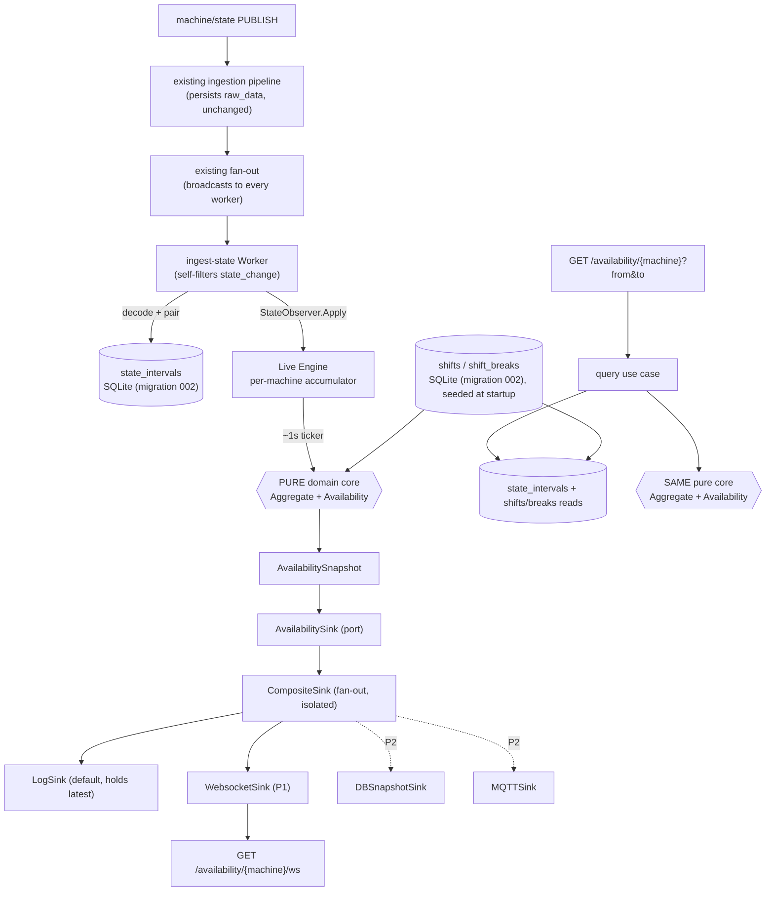

# Availability Design

**Spec**: `.specs/features/availability/spec.md`
**Context**: `.specs/features/availability/context.md`
**Status**: Draft

---

## Architecture Overview

A new bounded context **`internal/modules/oee/`** hosts OEE metrics. It is laid out so Performance and
Quality drop in as **siblings of `availability/`**, reusing a shared domain kernel and the same shift
config — this is the "escalável para o OEE completo" decision. The pure calculation core imports zero
infrastructure (CLAUDE.md rule), and both the live path and the on-demand path call it.

Two paths over one core:



**Key invariant:** the live path and the REST path differ only in (a) the time window
(`[shift_start, now]` vs. caller `[from,to]`) and (b) the interval source (in-memory open interval +
persisted vs. persisted only). The aggregation + formula are identical, pure, and shared.

---

## Module Layout (scalable to full OEE)

```
internal/modules/oee/
├── domain/                              # SHARED KERNEL (research §6.1) — used by all factors
│   ├── machine_state.go                 # MachineState + IsDowntime()/IsPlannedStop()
│   ├── shift.go                         # Shift, Break, PlannedProductionTime(window)
│   └── errors.go
├── config/                              # shift/break registry (AVAIL-01..03)
│   ├── domain/                          # (kernel reused) seed model
│   ├── application/                     # SeedUseCase + ShiftStore port + dto + mocks
│   └── adapters/outbound/database/      # shifts/shift_breaks repo
└── availability/
    ├── domain/                          # availability-specific domain
    │   ├── interval.go                  # StateInterval value object
    │   ├── snapshot.go                  # AvailabilitySnapshot
    │   ├── calculator.go                # PURE Aggregate() + Availability()  (research §6.3)
    │   └── errors.go
    └── features/
        ├── ingest-state/                # AVAIL-04..07  (write side, MQTT-driven)
        │   ├── application/             # UseCase + ports: IntervalStore, StateObserver + dto + mocks
        │   └── adapters/
        │       ├── inbound/worker/      # fanout.Worker impl (self-filters state_change)
        │       └── outbound/database/   # state_intervals repository
        ├── live/                        # AVAIL-11..15, 21, 25  (live calc + sinks)
        │   ├── application/             # Engine (accumulator+ticker) + AvailabilitySink port + dto + mocks
        │   └── adapters/
        │       ├── inbound/http_handler/# websocket endpoint /availability/{machine}/ws
        │       └── outbound/sink/
        │           ├── composite/       # fan-out, failure isolation
        │           ├── logsink/         # default sink + latest-snapshot holder
        │           └── websocket/       # WebsocketSink + connection hub (coder/websocket)
        └── query/                       # AVAIL-16..19  (read side, REST)
            ├── application/             # UseCase + ports: IntervalReader, ShiftReader + dto + mocks
            └── adapters/
                ├── inbound/http_handler/# GET /availability/{machine}?from&to
                └── outbound/database/   # reads state_intervals
```

> Use `/hexagonal-scaffold` per feature to generate the `domain → application(interface.go) → adapters`
> skeleton so the layout matches the existing `audit/raw` feature exactly.

---

## Code Reuse Analysis

### Existing Components to Leverage

| Component | Location | How to Use |
| --- | --- | --- |
| `fanout.Worker` interface | `internal/modules/processing/fanout/interface.go` | `ingest-state` worker implements `Name/Process/Close`; registered in `allWorkers`. |
| `LoggerWorker` reference | `internal/modules/processing/workers/logger/logger_worker.go` | Template for the new worker (self-filter pattern). |
| `message.Message` | `internal/common/message/message.go` | Worker decodes `msg.Payload` ([]byte) → `StateChange`; `msg.Topic` selects state messages. |
| `observability.Logger` | `internal/common/observability` | Injected into engine/worker/sinks; `NopLogger` in tests. |
| Migrator (numbered SQL) | `internal/platform/database/migrator.go` | Add `002_create_oee_availability.sql`. **Splitter splits on `;` → no `CREATE TRIGGER`.** |
| SQLite repo pattern + mutex | `internal/platform/database/ingestion/repository.go` | Mirror tx + `sync.Mutex` (SQLite single-writer) for interval/shift repos. |
| Audit feature (hexagonal read) | `internal/modules/audit/raw/features/get-by-topic/` | Blueprint for `query` feature: domain→application(`interface.go`+dto)→adapters(in http / out db). |
| HTTP handler + `RegisterRoutes` | `.../get-by-topic/adapters/inbound/http_handler` | Mirror for REST query + ws endpoint; Go 1.22 mux patterns (`GET /a/{x}`). |
| Bootstrap wiring | `cmd/broker/bootstrap/modules.go`, `server.go` | Add engine/worker construction in `InitModules`; register routes + start ticker in `StartServers`. |
| `cfg.Topics`, `config.Load` | `cmd/broker/config/config.go` | Add OEE env vars (state topic, tick, ws, shift seed path). |

### Integration Points

| System | Integration Method |
| --- | --- |
| Ingestion pipeline | **Unchanged.** `machine/state` must be one of `BROKER_TOPICS` (exact match, ≤5). Raw persistence stays. |
| Fan-out | New worker appended to `allWorkers`; it self-filters (fan-out broadcasts all messages). |
| HTTP server | REST query + ws endpoint registered on the existing `mux` in `StartServers`. |
| Lifecycle | Engine ticker started as a goroutine in `StartServers` (like `Pipeline.Start`); stopped via context + `GracefulShutdown`. |
| Database | Migration `002` adds `shifts`, `shift_breaks`, `state_intervals`; shared `*sql.DB` injected (platform owns lifecycle). |

---

## Components

### 1. Shared kernel — `oee/domain`

- **Purpose**: Domain types shared by every OEE factor (research §6.1).
- **Interfaces** (pure):
  - `type MachineState string` + `IsDowntime() bool` (`stopped|setup|maintenance`), `IsPlannedStop() bool` (`setup|maintenance`), `Valid() bool`.
  - `type Shift struct { ID, Name, MachineID string; StartMin, EndMin int; Weekdays []time.Weekday; Breaks []Break; TZ string }`
  - `PlannedProductionTime(w Window) time.Duration` — resolves shift occurrences across the window, subtracts breaks. Pure.
  - `type Break struct { StartMin, EndMin int; Type string }`, `type Window struct { From, To time.Time }`.
- **Dependencies**: `time` only.
- **Reuses**: research §6.1 definitions verbatim.

### 2. Pure calculator — `oee/availability/domain/calculator.go`

- **Purpose**: The single Availability formula + interval aggregation (research §3.1.1, §6.3).
- **Interfaces** (pure):
  - `Aggregate(w Window, intervals []StateInterval, planned time.Duration) Input` — clips intervals to `w`, sums planned vs. unplanned downtime.
  - `Availability(in Input) Result` — `Availability = RunTime / PlannedProductionTime`, clamped `[0,1]`; guards `planned==0`.
  - `Input{ PlannedProductionTime, PlannedDowntime, UnplannedDowntime time.Duration }`
  - `Result{ Availability float64; PlannedTime, RunTime, PlannedDowntime, UnplannedDowntime time.Duration; HasData bool }`
- **Dependencies**: `oee/domain`, `time`.
- **Reuses**: research §6.3 `Calculate` (Availability portion only).

### 3. Ingest-state worker — `oee/availability/features/ingest-state`

- **Purpose**: Turn `state_change` messages into durable, paired `state_intervals` and notify the live engine.
- **Location**: `adapters/inbound/worker/` (impl `fanout.Worker`), `application/` (use case), `adapters/outbound/database/` (repo).
- **Interfaces**:
  - Worker `Process(ctx, msg)`: if `msg.Topic != stateTopic` → return nil; else decode `StateChange`, validate, delegate to use case.
  - `application.UseCase.Apply(ctx, StateTransition) error` — close open interval at `t`, open new one, persist, then `observer.Apply`.
  - Outbound ports (`interface.go`): `IntervalStore { OpenInterval(ctx, machine, state, startedAt) ; CloseOpen(ctx, machine, endedAt) ; LastOpen(ctx, machine) (StateInterval, bool, error) }`, `StateObserver { Apply(StateTransition) }`.
- **Dependencies**: `IntervalStore`, `StateObserver`, `Logger`, the state topic name.
- **Reuses**: `fanout.Worker`, `LoggerWorker` pattern, repo tx+mutex pattern.
- **Edge handling**: no-op transition ignored; non-increasing timestamp clipped/rejected; missing fields → log+skip (AVAIL-05); never panics.

### 4. Live engine — `oee/availability/features/live/application`

- **Purpose**: Per-machine in-memory accumulator; recompute each ~1 s; emit snapshot via the sink port.
- **Interfaces**:
  - `Engine.Apply(StateTransition)` — implements `ingest-state`'s `StateObserver`; updates per-machine open interval + running window.
  - `Engine.Start(ctx)` — ticker loop (interval configurable, default 1 s); for each tracked machine: build `Window=[shift_start_today, now]`, read shift planned time, call `Aggregate`+`Availability`, wrap as `AvailabilitySnapshot`, call `sink.Update`.
  - **Output port** (the "one ready interface"): `AvailabilitySink interface { Update(ctx, AvailabilitySnapshot) error }`.
  - On restart, `Engine` rehydrates open intervals from `IntervalStore.LastOpen`.
- **Dependencies**: `AvailabilitySink`, shift reader, pure calculator, `Logger`, clock (injectable for tests).
- **Reuses**: pure calculator (component 2); shift kernel (component 1).
- **Concurrency**: `Apply` (worker goroutines) and the ticker both touch per-machine state → guard with `sync.Mutex`/`sync.Map`; must be `-race` clean.

### 5. Sinks — `oee/availability/features/live/adapters/outbound/sink`

- **CompositeSink**: holds `[]AvailabilitySink`; `Update` fans out, each sink isolated (own goroutine/buffered, timeout, error-logged) so a slow ws client never blocks the engine or other sinks (AVAIL-13).
- **LogSink** (default, P1): logs at debug + stores the latest snapshot per machine in memory (feeds P3 `/live`).
- **WebsocketSink** (P1): owns a connection **hub** keyed by `machine_id`; `Update` marshals the snapshot to JSON and writes to each subscribed conn (non-blocking, drop-on-slow). Backed by an HTTP upgrade handler.
- **Dependencies**: `Logger`; WebsocketSink also a ws library (see Tech Decisions).

### 6. Websocket endpoint — `oee/availability/features/live/adapters/inbound/http_handler`

- **Purpose**: `GET /availability/{machine}/ws` upgrades to websocket and registers the conn with the WebsocketSink hub for `{machine}`.
- **Reuses**: `RegisterRoutes(mux)` pattern; same `mux` as audit.

### 7. Query feature — `oee/availability/features/query`

- **Purpose**: On-demand REST Availability for `[from,to]` (AVAIL-16..19), mirroring `audit/raw/get-by-topic`.
- **Interfaces**:
  - `GET /availability/{machine}?from=<rfc3339>&to=<rfc3339>` → handler validates, calls use case.
  - `UseCase.Execute(ctx, machine, Window) (*Output, error)` — reads intervals overlapping window + shift planned time, calls pure core.
  - Outbound ports: `IntervalReader { ByMachineRange(ctx, machine, from, to) ([]StateInterval, error) }`, `ShiftReader { ForMachineWindow(ctx, machine, Window) (planned time.Duration, found bool, error) }`.
  - `Output` → JSON `{ availability, planned_production_time, run_time, downtime:{planned,unplanned}, interval_count, flags:{shift_config_missing, open_interval_clipped, no_data} }`.
- **Reuses**: audit handler/use case/repository blueprint; pure calculator.

### 8. Config / seeding — `oee/config`

- **Purpose**: Create `shifts`/`shift_breaks` (migration 002) and seed/upsert from a startup config source (AVAIL-01..03).
- **Interfaces**: `SeedUseCase.Execute(ctx, []Shift) error`; `ShiftStore { Upsert(ctx, Shift) ; ForMachineWindow(...) }`.
- **Seed source**: JSON file at `BROKER_OEE_SHIFTS_PATH` (parsed at boot); absent → skip seeding, runtime falls back to `shift_config_missing`.

---

## Data Models — migration `002_create_oee_availability.sql`

> Plain `CREATE TABLE`/`CREATE INDEX` only — the migrator splits on `;`, so **no triggers/procedures**.
> Timestamps stored as RFC3339Nano TEXT (matches `raw_data`).

### `shifts`

| Field | Type | Notes |
| --- | --- | --- |
| id | INTEGER PK AUTOINCREMENT | |
| name | TEXT NOT NULL | "Manhã", … |
| machine_id | TEXT NOT NULL | `''`/`*` = applies to all machines |
| start_minute | INTEGER NOT NULL | minutes from midnight (local TZ) |
| end_minute | INTEGER NOT NULL | may exceed 1440 for overnight shifts |
| weekdays | TEXT NOT NULL | CSV `0..6` (Sun..Sat); empty = all days |
| timezone | TEXT NOT NULL | IANA, defaults to `BROKER_TIMEZONE` |
| active | INTEGER NOT NULL DEFAULT 1 | |
| created_at | TEXT NOT NULL DEFAULT (datetime('now')) | |

Index: `(machine_id)`.

### `shift_breaks`

| Field | Type | Notes |
| --- | --- | --- |
| id | INTEGER PK AUTOINCREMENT | |
| shift_id | INTEGER NOT NULL | FK → shifts.id (logical) |
| start_minute | INTEGER NOT NULL | minutes from midnight |
| end_minute | INTEGER NOT NULL | |
| type | TEXT NOT NULL | `rest`/`meal`/`cleaning` |

Index: `(shift_id)`.

### `state_intervals`

| Field | Type | Notes |
| --- | --- | --- |
| id | INTEGER PK AUTOINCREMENT | |
| machine_id | TEXT NOT NULL | from payload, **not** topic |
| state | TEXT NOT NULL | running/stopped/setup/idle/maintenance/off |
| is_downtime | INTEGER NOT NULL | derived (`stopped|setup|maintenance`) |
| is_planned_stop | INTEGER NOT NULL | derived (`setup|maintenance`) |
| started_at | TEXT NOT NULL | RFC3339Nano |
| ended_at | TEXT NULL | NULL = currently open; query clips open→`to` |
| reason | TEXT NOT NULL DEFAULT '' | |
| created_at | TEXT NOT NULL DEFAULT (datetime('now')) | |

Indexes: `(machine_id, started_at)`, `(machine_id, ended_at)`.

**Relationships**: one open interval per machine at a time; closing = `UPDATE ... SET ended_at WHERE machine_id=? AND ended_at IS NULL`.

`availability_snapshots` → deferred to migration `003` (P2, DB-snapshot sink).

---

## Error Handling Strategy

| Error Scenario | Handling | Impact |
| --- | --- | --- |
| Non-`state_change` message reaches worker | Return `nil` immediately (topic guard) | None — worker ignores |
| Malformed/partial `state_change` payload | Log warn, skip; never panic | Event dropped, pipeline alive (AVAIL-05) |
| Unknown/invalid state value | `MachineState.Valid()` false → log+skip | Event dropped |
| Out-of-order / duplicate timestamp | Ignore no-op; clip/reject backward ts | Interval monotonicity preserved |
| `PlannedProductionTime == 0` (window in break / no shift overlap) | Return `HasData=false`, `availability=null` | REST 200 `no_data:true`; live snapshot flagged |
| No shift configured for machine | Fall back to wall-clock window; `shift_config_missing` flag | Result returned, flagged |
| Open interval at window end | Clip to `to`/`now`; `open_interval_clipped` flag | Correct partial result |
| REST `from/to` missing/unparseable/`from>=to` | `400` JSON error (audit convention) | Caller sees 400 |
| Slow/dead websocket client | Drop conn, isolated in CompositeSink | Engine + other sinks unaffected (AVAIL-13) |
| Sink `Update` error | Log, continue other sinks | Degraded delivery, no crash |
| DB write failure (interval) | Wrap `ErrStoreFailure`, log; engine still ticks from memory | Persistence gap logged |

---

## Configuration (new env vars)

| Var | Default | Purpose |
| --- | --- | --- |
| `BROKER_OEE_ENABLED` | `true` | Master switch for the OEE/availability module |
| `BROKER_OEE_STATE_TOPIC` | `machine/state` | Topic carrying `state_change` (must be in `BROKER_TOPICS`) |
| `BROKER_OEE_TICK_INTERVAL` | `1s` | Live recompute cadence |
| `BROKER_OEE_WS_ENABLED` | `true` | Register the websocket sink + endpoint |
| `BROKER_OEE_SHIFTS_PATH` | `` (none) | JSON file of shift/break definitions seeded at startup |

> Note the **5-topic cap**: `.env.example` currently fills all 5 slots; adding `machine/state`
> requires freeing one. Recommended forward-looking set: `machine/state, machine/production,
> machine/cycle, machine/quality` (+1 free) to cover full OEE by data type.

---

## Tech Decisions (non-obvious)

| Decision | Choice | Rationale |
| --- | --- | --- |
| Module placement | New `internal/modules/oee/` bounded context with shared kernel | Scales to Performance/Quality/OEE as siblings (user: "melhor e mais escalável") |
| One calc, two paths | Pure `Aggregate`+`Availability` in `domain`, no infra | CLAUDE.md rule; identical math live & on-demand; trivially unit-testable (§7 oracle) |
| Live↔write decoupling | Worker depends on `StateObserver` port; engine implements it | Inward deps; features stay independent; wired in bootstrap |
| Sink extensibility | Single `AvailabilitySink.Update` port + CompositeSink fan-out | "Uma interface pronta"; DB/MQTT/ws are swappable sinks with zero core change |
| Websocket library | `github.com/gorilla/websocket` (user-chosen) | Mature, battle-tested, pure Go (no cgo) → keeps the static `CGO_ENABLED=0` build. First third-party runtime dep; isolated inside the WebsocketSink adapter so it never leaks into domain/application. |
| Shift model | time-of-day minutes + weekday mask, occurrences resolved per window | Recurring shifts across multi-day `[from,to]`; avoids per-day rows |
| Open interval persistence | Persist with `ended_at NULL`, update on close | Survives restart; query can clip the open interval |
| Migration safety | `002` uses only `CREATE TABLE/INDEX` | Migrator splits on `;`; trigger bodies would break it |

---

## Open Questions / Risks

- **Websocket dependency**: adds `github.com/coder/websocket`. Pure-Go, no cgo, no transitive deps — consistent with the static build, but it is the first non-test third-party runtime import. Flagged for confirmation at Tasks/Execute time.
- **Idle/off semantics**: per research, `idle`/`off` are not downtime. `off` is excluded from planned time; `idle` currently counts as run time (could inflate Availability). MVP follows the research literally; revisit if the user wants `idle` penalized.
- **Live window definition**: MVP uses `[shift_start_today, now]`; machines with no shift use `[process_start_or_first_event, now]`. Confirm at UAT.
